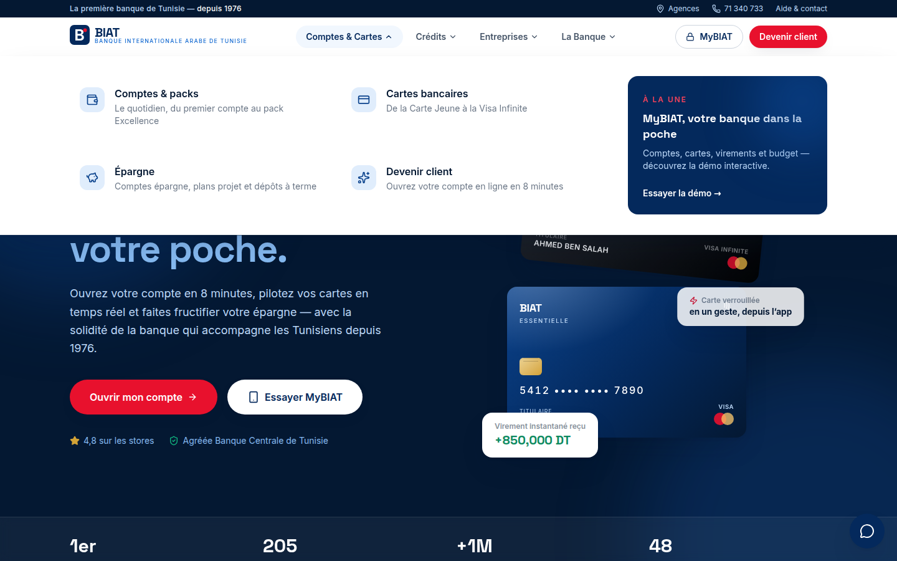
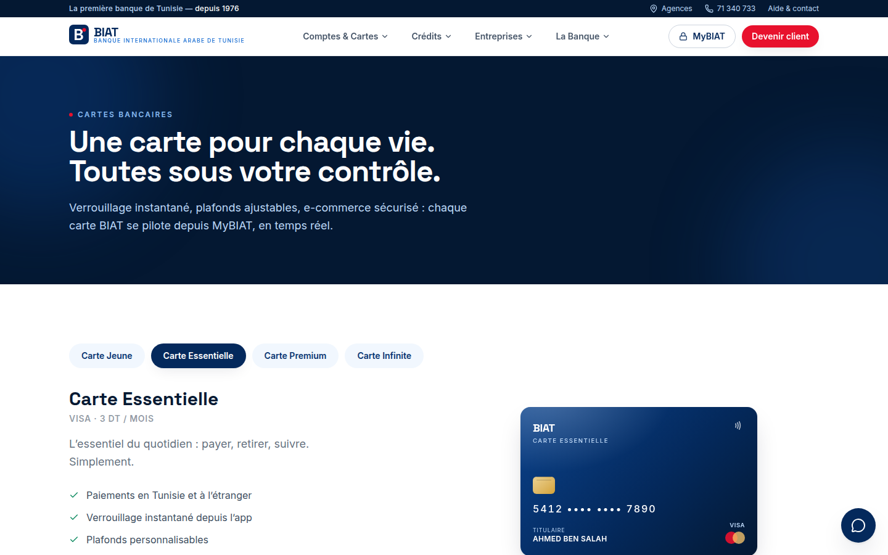
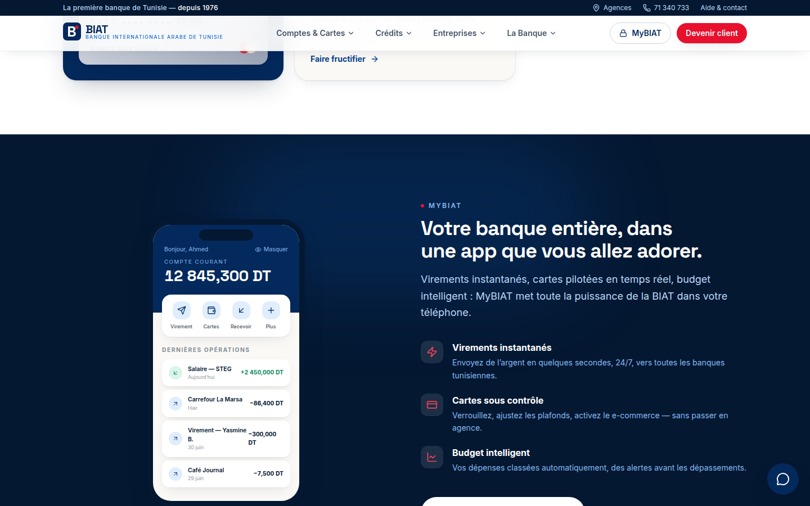
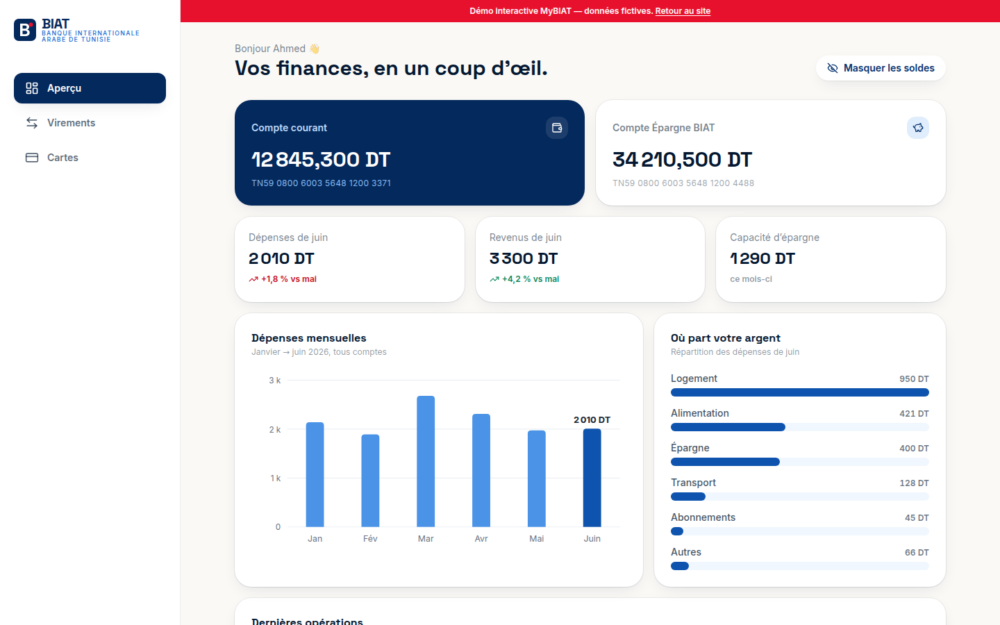

# BIAT — La première banque de Tunisie, réinventée 🇹🇳

Concept complet de refonte du site de la **BIAT (Banque Internationale Arabe de Tunisie)**,
construit au niveau des meilleures banques du monde (Revolut, Monzo, BNP Paribas, Chase,
BoursoBank…) après une étude comparative de 12 banques en France, au Royaume-Uni et aux USA.

> ⚠️ Projet de démonstration non officiel. Toutes les données (taux, produits, agences,
> transactions) sont fictives.

## Lancer le site

```bash
npm install
npm run dev        # http://localhost:5173
```

Build de production : `npm run build` puis `npm run preview`.

## Ce qui est inclus

### Site vitrine (marketing)
- **Accueil** — hero avec cartes 3D, barre de confiance chiffrée, actions rapides,
  taux de change du jour, grille bento des produits, vitrine de l’app, mini-simulateur
  de crédit en direct, portes d’entrée par segment (Jeunes / Pro / Entreprises / TRE),
  actualités et Fondation BIAT
- **Particuliers** — 3 packs comparés + simulateur d’épargne interactif
- **Cartes** — showcase interactif des 4 cartes (Jeune → Infinite) + tableau comparatif complet
- **Crédits** — simulateur complet (immobilier / auto / conso) : montant, durée,
  mensualité, coût total calculés en direct
- **Entreprises** — financement, commerce international, cash management, monétique,
  enveloppe transition énergétique
- **La Banque** — histoire 1976→2026, chiffres clés, Fondation BIAT
- **Agences** — localisateur avec recherche et filtres par région (22 agences de démo)
- **Aide & contact** — canaux, FAQ accordéon, formulaire
- **Devenir client** — parcours d’ouverture de compte en 4 étapes avec validation

### MyBIAT — démo interactive de banque en ligne (`/mybiat`)
- Aperçu : soldes masquables, tuiles de stats avec variations, **graphique des dépenses
  mensuelles** et **répartition par catégorie**, historique d’opérations
- **Virements instantanés fonctionnels** : le solde et l’historique se mettent à jour en direct
- **Gestion de cartes** : verrouillage, e-commerce, plafonds — effet immédiat
- Navigation adaptée mobile (barre d’onglets) et desktop (sidebar)

### Expérience transverse
- Méga-menu par besoin avec mise en avant éditoriale, header collant, tiroir mobile
- Assistant conversationnel (réponses instantanées + liens d’action)
- Animations au scroll (Framer Motion), micro-interactions, `prefers-reduced-motion` respecté
  par le navigateur
- Direction artistique : « le bleu possède le site, le rouge possède l’action » —
  bleu institutionnel BIAT + rouge signature réservé aux CTA

## Stack

| Couche | Choix |
|---|---|
| Front | React 19 + TypeScript + Vite 8 |
| Styles | Tailwind CSS v4 (design tokens custom BIAT) |
| Animations | Framer Motion |
| Icônes | Lucide |
| Typographies | Space Grotesk (display) + Inter (texte), auto-hébergées |
| Données | 100 % côté client (mock) — aucun backend ni clé API requis |

Le state de la démo bancaire est géré par un store React Context (`src/demo/store.tsx`) :
brancher un vrai backend revient à remplacer ce fichier par des appels API.

## Aperçu

| | |
|---|---|
|  |  |
|  |  |
